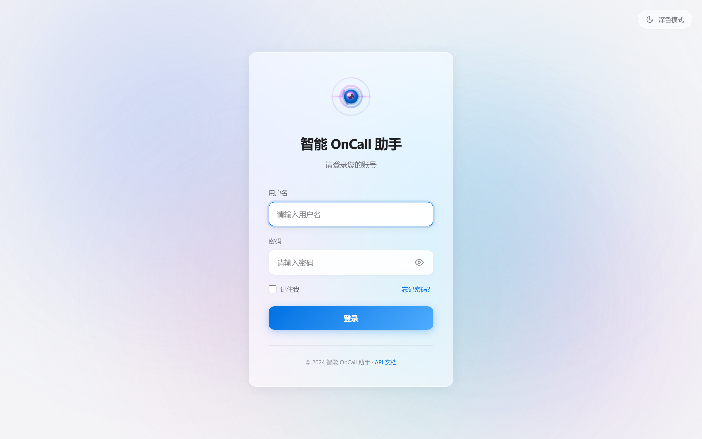
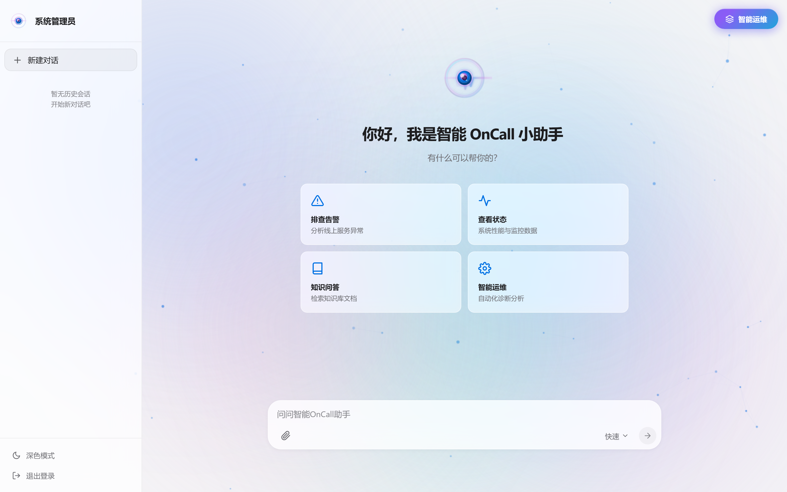
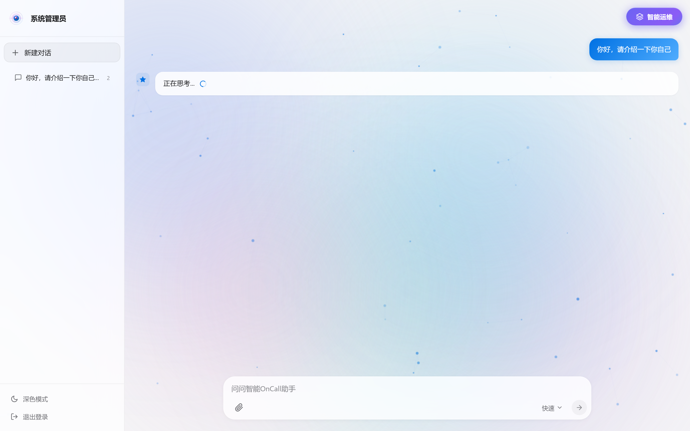

<div align="center">


# VigilOpsAgent

> 企业级智能对话与运维助手 — RAG 知识库问答 + AIOps 智能诊断

[](https://www.python.org/)
[](https://fastapi.tiangolo.com/)
[](https://langchain-ai.github.io/langgraph/)
[](https://milvus.io/)
[](LICENSE)

[快速开始](#快速开始) · [API 文档](#api-接口) · [架构概览](#架构概览) · [配置说明](#配置说明) · [常见问题](#常见问题)

</div>

## 概述

VigilOpsAgent 是一个基于 **LangGraph** 构建的企业级智能运维助手，提供两条核心能力路径：

- **RAG 对话**：基于 Milvus 向量检索的知识库问答，支持文档上传与自动索引，结合 MCP 工具调用实现多轮对话
- **AIOps 诊断**：Plan-Execute-Replan 模式的自动故障诊断，通过 MCP 协议接入日志查询和监控数据工具，动态调整诊断策略并生成结构化报告

内置用户认证、会话管理、长期记忆（用户画像自动提取）、定时 AIOps 等企业级功能。

## 核心特性

- **智能对话** — LangGraph 多轮对话 + SSE 流式输出
- **RAG 知识库** — 向量检索增强，支持文档上传、自动分块索引、可选 Rerank 精排
- **AIOps 诊断** — Plan-Execute-Replan 自动故障诊断与根因分析
- **长期记忆** — 自动从对话中提取用户画像，跨会话持久化
- **用户认证** — JWT 令牌 + 会话生命周期管理
- **MCP 工具集成** — 日志查询（CLS）和监控数据（Monitor）工具接入
- **定时任务** — 可配置的周期性 AIOps 自动诊断 + Webhook 回调
- **Web 界面** — 现代化 UI，支持登录、对话、文档上传、智能运维

## 应用界面

### 登录页面



### 对话主页



### 智能对话



## 技术栈

| 类别 | 选型 |
|------|------|
| 语言 | Python >= 3.11 |
| Web 框架 | FastAPI + Uvicorn |
| Agent 框架 | LangGraph + langchain-qwq（ChatQwen 原生集成） |
| LLM | 阿里云 DashScope（通义千问） |
| 向量库 | Milvus（langchain-milvus + pymilvus） |
| 工具协议 | MCP（langchain-mcp-adapters + fastmcp） |
| 数据库 | MySQL（鉴权 + 会话）/ PostgreSQL（checkpoint + Store + 对话历史）/ Redis（热 checkpoint + 消息队列） |
| 日志 | Loguru |
| 包管理 | uv |

## 快速开始

### 环境要求

- Python >= 3.11
- Docker（用于运行 Milvus 向量数据库）
- 阿里云 DashScope API Key（[获取地址](https://dashscope.aliyun.com/)）

### 安装

```bash
# 1. 克隆项目
git clone <repository_url>
cd vigil_ops_agent

# 2. 安装依赖
uv pip install -e .

# 3. 配置环境变量
# 编辑 .env 文件，填入 DASHSCOPE_API_KEY
cp .env.example .env  # 或直接编辑 .env

# 4. 一键初始化（启动 Docker Milvus + 服务 + 上传文档）
make init
```

> [!TIP]
> `make init` 会自动完成：启动 Milvus 容器 → 启动所有服务 → 等待就绪 → 上传知识库文档。

### Windows 用户

Windows 不支持 `make`，使用内置批处理脚本：

```powershell
.\start-windows.bat    # 启动所有服务
.\stop-windows.bat     # 停止所有服务
```

<details>
<summary>Windows 手动启动步骤</summary>

```powershell
# 1. 创建虚拟环境并安装依赖
uv venv
.venv\Scripts\activate
uv pip install -e .

# 2. 编辑 .env 文件，填入 DASHSCOPE_API_KEY
notepad .env

# 3. 启动 Docker Desktop，然后启动 Milvus
docker compose -f docker_compose.yml up -d

# 4. 分别在新窗口启动各服务
python mcp_servers/cls_server.py        # CLS MCP 服务 (8003)
python mcp_servers/monitor_server.py    # Monitor MCP 服务 (8004)
python -m uvicorn app.main:app --host 0.0.0.0 --port 9999  # FastAPI (9999)
```

</details>

### 访问服务

| 服务 | 地址 |
|------|------|
| Web 界面 | http://localhost:9999 |
| API 文档（Swagger） | http://localhost:9999/docs |
| Attu（Milvus Web UI） | http://localhost:8000 |
| MinIO | http://localhost:9001（admin/minioadmin） |

## API 接口

### 对话与运维

| 功能 | 方法 | 路径 | 说明 |
|------|------|------|------|
| 普通对话 | POST | `/api/chat` | 一次性返回完整响应 |
| 流式对话 | POST | `/api/chat/stream` | SSE 流式输出 |
| AIOps 诊断 | POST | `/api/aiops` | 自动故障诊断（流式） |
| 文件上传 | POST | `/api/upload` | 上传文档并建立向量索引 |
| 健康检查 | GET | `/health` | 服务状态检查 |

### 认证与会话

| 功能 | 方法 | 路径 | 说明 |
|------|------|------|------|
| 用户登录 | POST | `/api/auth/login` | 获取 JWT 令牌 |
| 会话列表 | GET | `/api/sessions` | 查询当前用户会话 |
| 创建会话 | POST | `/api/sessions` | 创建新对话会话 |
| 更新会话 | PUT | `/api/sessions/{id}` | 更新会话标题等 |
| 删除会话 | DELETE | `/api/sessions/{id}` | 软删除会话 |

### 使用示例

```bash
# 流式对话
curl -X POST "http://localhost:9999/api/chat/stream" \
  -H "Content-Type: application/json" \
  -d '{"Id":"session-123","Question":"什么是向量数据库？"}' \
  --no-buffer

# AIOps 诊断
curl -X POST "http://localhost:9999/api/aiops" \
  -H "Content-Type: application/json" \
  -d '{"session_id":"session-123"}' \
  --no-buffer
```

## 架构概览

```
┌─────────────────────────────────────────────────────────────────┐
│                        Web 界面 (static/)                       │
└──────────────────────────┬──────────────────────────────────────┘
                           │ SSE / REST
┌──────────────────────────▼──────────────────────────────────────┐
│                     FastAPI 应用 (app/)                         │
│  ┌─────────┐  ┌──────────┐  ┌──────────┐  ┌────────────────┐    │
│  │ api/    │  │ services/│  │  agent/  │  │    core/       │    │
│  │ 路由层   │→ │ 业务逻辑 │ →│ LangGraph│ →│  基础设施       │    │
│  │         │  │          │  │ + MCP    │  │  LLM / DB /    │    │
│  │         │  │          │  │          │  │  Redis / Milvus│    │
│  └─────────┘  └──────────┘  └──────────┘  └────────────────┘    │
└─────────────────────────────────────────────────────────────────┘
         │                    │                    │
    ┌────▼────┐        ┌─────▼─────┐       ┌─────▼─────┐
    │  MySQL  │        │PostgreSQL │       │   Redis   │
    │鉴权+会话│        │checkpoint │       │热checkpoint│
    │         │        │+Store+历史│       │+消息队列  │
    └─────────┘        └───────────┘       └───────────┘
```

**两条核心路径：**

- **RAG 对话**：`api/chat.py` → `rag_agent_service` → LangGraph Agent（含 MCP 工具调用 + Milvus 检索）→ SSE 流式 → 异步持久化
- **AIOps 诊断**：`api/aiops.py` → `aiops_service` → Plan-Execute-Replan 循环 → SSE 流式

**关键设计模式：**

- **全局服务单例**：模块级实例，直接 `import` 使用
- **MCP 聚合**：`MultiServerMCPClient` 连接多个 MCP 服务器，内置指数退避重试
- **双层记忆**：Redis（热 checkpoint，TTL=7天）+ PostgreSQL（冷 checkpoint fallback）
- **长期记忆**：Agent 执行后自动提取用户画像，通过 Store 跨会话持久化
- **三级消息降级**：Redis List → 内存队列 → 兜底日志文件

## 项目结构

```
vigil_ops_agent/
├── app/                                # 应用核心
│   ├── main.py                         # FastAPI 入口（生命周期、路由、中间件）
│   ├── config.py                       # Pydantic Settings 配置管理
│   ├── api/                            # API 路由层
│   │   ├── chat.py                     #   对话接口（RAG 聊天）
│   │   ├── aiops.py                    #   AIOps 诊断接口
│   │   ├── auth.py                     #   认证接口（登录）
│   │   ├── sessions.py                 #   会话管理接口
│   │   ├── file.py                     #   文件上传接口
│   │   └── health.py                   #   健康检查
│   ├── services/                       # 业务服务层
│   │   ├── rag_agent_service.py        #   RAG Agent（LangGraph 状态图）
│   │   ├── aiops_service.py            #   AIOps 服务（Plan-Execute-Replan）
│   │   ├── auth_service.py             #   认证业务逻辑
│   │   ├── conversation_session_service.py  # 会话管理
│   │   ├── long_term_memory_service.py #   长期记忆（用户画像 CRUD）
│   │   ├── scheduler/                  #   定时任务
│   │   │   └── aiops_scheduler.py      #     定时 AIOps 诊断
│   │   └── vector/                     #   向量服务
│   │       ├── store_manager.py        #     向量存储管理
│   │       ├── embedding_service.py    #     Embedding 生成
│   │       ├── index_service.py        #     向量索引
│   │       ├── search_service.py       #     向量检索
│   │       └── rerank_service.py       #     Rerank 精排
│   ├── agent/                          # Agent 模块
│   │   ├── context.py                  #   AgentContext 运行时上下文
│   │   ├── mcp_client.py              #   MCP 客户端（MultiServerMCPClient）
│   │   └── aiops/                      #   AIOps 核心
│   │       ├── planner.py              #     计划制定
│   │       ├── executor.py             #     步骤执行
│   │       ├── replanner.py            #     动态重规划
│   │       ├── state.py                #     状态定义
│   │       └── utils.py                #     工具函数
│   ├── models/                         # 数据模型
│   │   ├── dto/                        #   请求/响应 DTO
│   │   │   ├── auth_request.py         #     认证请求模型
│   │   │   ├── chat_request.py         #     对话请求模型
│   │   │   ├── aiops.py               #     AIOps 模型
│   │   │   └── response.py            #     通用响应模型
│   │   ├── entity/                     #   ORM 实体
│   │   │   ├── user.py                 #     用户表
│   │   │   └── conversation_session.py #     会话表
│   │   └── document.py                 #   文档模型
│   ├── core/                           # 核心基础设施
│   │   ├── llm_factory.py              #   LLM 工厂（模型管理）
│   │   ├── auth_resolver.py            #   JWT 认证核心
│   │   ├── document_splitter.py        #   文档分割（LangChain）
│   │   ├── feature_extractor.py        #   通用特征提取器
│   │   ├── feature_extraction_middleware.py  # 用户画像提取中间件
│   │   ├── profile_reducer.py          #   画像归约（Reducer）
│   │   ├── redis_checkpointer.py       #   Redis Checkpointer
│   │   └── manager/                    #   数据库连接管理
│   │       ├── milvus_client.py        #     Milvus
│   │       ├── mysql_client.py         #     MySQL
│   │       ├── postgres_client.py      #     PostgreSQL
│   │       └── redis_client.py         #     Redis
│   ├── tools/                          # Agent 工具集
│   │   ├── knowledge_tool.py           #   知识库查询
│   │   └── time_tool.py                #   时间工具
│   └── utils/                          # 工具类
│       ├── logger.py                   #   Loguru 日志配置
│       └── redis_queue.py              #   Redis 消息队列（三级降级）
├── static/                             # Web 前端
│   ├── index.html                      #   主页面
│   ├── login.html                      #   登录页面
│   ├── js/                             #   前端逻辑
│   └── css/                            #   样式表
├── mcp_servers/                        # MCP 服务器
│   ├── cls_server.py                   #   CLS 日志查询 (8003)
│   └── monitor_server.py               #   监控数据 (8004)
├── tests/                              # 测试
├── aiops-docs/                         # 运维知识库文档
├── sql/                                # 数据库初始化 SQL
├── docker_compose.yml                  # Milvus Docker Compose 配置
├── pyproject.toml                      # 项目配置与依赖
├── Makefile                            # 项目管理命令
├── start-windows.bat                   # Windows 启动脚本
└── stop-windows.bat                    # Windows 停止脚本
```

## 配置说明

通过项目根目录 `.env` 文件配置，所有变量在 `app/config.py` 中声明：

```bash
# === LLM（必填）===
DASHSCOPE_API_KEY=sk-xxxxx
DASHSCOPE_API_BASE=https://dashscope.aliyuncs.com/compatible-mode/v1
DASHSCOPE_MODEL=qwen-max

# === Milvus ===
MILVUS_HOST=localhost
MILVUS_PORT=19530

# === RAG ===
RAG_TOP_K=3
CHUNK_MAX_SIZE=800
CHUNK_OVERLAP=100
RERANK_ENABLED=False          # 启用 Rerank 需同时配置下方参数
DASHSCOPE_RERANK_MODEL=qwen3-rerank

# === MCP ===
MCP_CLS_URL=http://localhost:8003/mcp
MCP_MONITOR_URL=http://localhost:8004/mcp

# === 定时 AIOps ===
ENABLE_SCHEDULED_AIOPS=False  # 启用后周期性自动执行诊断
```

> [!IMPORTANT]
> `DASHSCOPE_API_BASE` 必须设置为 `https://dashscope.aliyuncs.com/compatible-mode/v1`，否则默认访问新加坡站点导致鉴权失败。

## 开发指南

### 常用命令

```bash
# 一键操作
make init              # 初始化（Docker + 服务 + 文档上传）
make start             # 启动所有服务（MCP + FastAPI）
make stop              # 停止所有服务
make restart           # 重启所有服务

# 开发模式
make dev               # 前台运行，支持热重载

# 代码质量（PR 前必须通过）
make format            # ruff format + isort
make lint              # ruff check
make test              # pytest --cov
make check-all         # format + lint + test

# 文档管理
make upload            # 上传 aiops-docs/*.md 到 Milvus
make list-docs         # 列出可上传文档

# 其他
make logs              # 查看服务日志
make clean             # 清理临时文件
make coverage          # 查看测试覆盖率报告
make status-mcp        # 检查 MCP 服务状态
```

### 添加新依赖

```bash
# 生产依赖
uv pip install <package>

# 开发依赖
uv pip install -e ".[dev]"
```

## 常见问题

<details>
<summary>DASHSCOPE_API_KEY 报错</summary>

检查 `.env` 文件中的配置：

```bash
# Linux/macOS
grep DASHSCOPE_API_KEY .env

# Windows
type .env | findstr DASHSCOPE_API_KEY
```

确保 `DASHSCOPE_API_BASE` 指向中国大陆站点。

</details>

<details>
<summary>Milvus 连接失败</summary>

确保 Docker Desktop 已启动，然后检查容器状态：

```bash
docker ps | grep milvus

# 重启 Milvus
docker compose -f docker_compose.yml restart
```

</details>

<details>
<summary>端口被占用</summary>

```bash
# Linux/macOS — 查看占用进程
lsof -i :9999

# Windows
netstat -ano | findstr :9999
```

</details>

<details>
<summary>Windows 下 PowerShell 脚本执行策略限制</summary>

```powershell
# 临时允许（当前进程）
Set-ExecutionPolicy -ExecutionPolicy RemoteSigned -Scope Process

# 或使用 CMD
cmd
.\start-windows.bat
```

</details>

## 参考资源

- [FastAPI 文档](https://fastapi.tiangolo.com/)
- [LangGraph 文档](https://langchain-ai.github.io/langgraph/)
- [LangGraph Plan-Execute 模式](https://langchain-ai.github.io/langgraph/tutorials/plan-and-execute/)
- [阿里云 DashScope](https://dashscope.aliyun.com/)
- [MCP 协议](https://modelcontextprotocol.io/)
- [Milvus 文档](https://milvus.io/docs)

---

Author: **chief** | License: MIT
